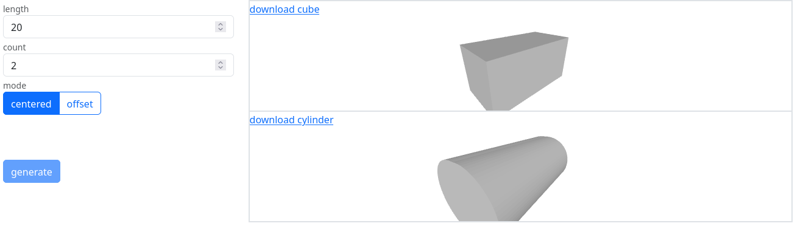

# openswebcad 2

OpenSWebCAD (OpenSCAD+web) generates STL objects from python code via openscad in your browser.

## Differences to other projects
[OpenSCAD](https://openscad.org/) is what started the whole journey.
However, the original OpenSCAD language is kind of cumbersome (it's not even turing-complete).
Nowadays, OpenSCAD allows integration of Python code directly, but there is already another ecosystem which relies on generating OpenSCAD code *from* Python, e.g. [SolidPython(2)](https://pypi.org/project/solidpython2/) and [MuSCAD](https://pypi.org/project/muscad/).
These rely completely on Python to do all variable handling, and only export constants to OpenSCAD, so the actual openscad code is not parametrized anymore.

Generation of OpenSCAD code requires a local Python installation and command line usage, which is not accessible to every user (we expect users of our models to operate their own printers, but some people just order printed parts online).
Various projects exist which allow parametrization of models for openscad variables in the browser, e.g. [3dcustomizer.net/sandbox](https://3dcustomizer.net/sandbox) and [ochafik.com/openscad2](https://ochafik.com/openscad2/).

OpenSWebCAD provides a similar experience as those services, but for the Python-centric workflow without OpenSCAD variables.

Note that this project is aimed at open-source-hardware enthusiasts.
Users accessing the final website will be able to read the model generation code.

## How to use

Take a look at the [example web interface](https://hephaisto.github.io/openswebcad2).

### Getting started
* Clone the repository
* replace the `generate` function in `model.py` with the python code you use to generate the OpenSCAD code.
  See below for details for the function signature.
* optional: Change `packages.js` to include Python libraries (e.g. `solidpython2`)
* optional: adapt README of this project to match your own
* serve the folder via an HTTP server of your choice (opening the files directly via a `file://` URL is not possible due to security restrictions.
  * To deploy via GitHub pages, all you need to do is push your own modified clone to your github account, and deploy the `main` branch.

### Function signature

#### Parameters
The parameters are automatically extracted from the function signature. The example

    def generate(length: float, count: int, mode: Literal["centered", "offset"]) -> list[tuple[str, str]]:

will be rendered as

.

The following parameter types are supported:
* float: for a floating-point number
* int: for whole numbers
* Literal: for explicit choices

#### Return values
The `generate` function must return a list of (title, code) tuples, with the title being used for titling the boxes and naming download files, while the code must be a valid OpenSCAD code.
You can return multiple models, and each model gets its own 3D-preview and download button.

#### Errors
You can raise any exception in your code.
However, if you know that one or more parameters are invalid (in combination), you should prefer to raise an `InvalidParameterException` with the list of incompatible parameters and a message explaining what's wrong.

## Used libraries
This project uses the following libraries:
* [OpenSCAD-WASM](https://github.com/openscad/openscad-wasm), a web-assembly port of OpenSCAD (GPL 2.0, [included](./openscad-wasm/LICENSE))
* [Pyodide](https://pyodide.org) to compile the python generation code to WASM (Mozilla Public License 2.0, referenced)
* [bootstrap](https://getbootstrap.com) to style the input widgets (MIT, referenced)
* [kowacsv/Online3DViewer](https://github.com/kovacsv/Online3DViewer) to display the generated files (MIT, [included](./o3dv/o3dv.license.md))

## License
openswebcad 2.0 is licensed under the MIT license.
The inclusion of GPL-libraries will probably also "infect" this project, so if you are concerned about that, you should probably distribute the corresponding libraries separately.

